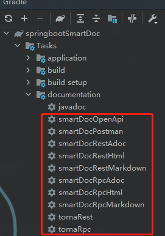

# springboot-smartdoc
smartdoc生成在线接口文档

### smart-doc gitee地址
**https://gitee.com/smart-doc-team/smart-doc**

## smart-doc在线生成接口文档
#### （1）gradle中引入smart-doc包
    buildscript {
         repositories {
             maven { url 'http://maven.aliyun.com/nexus/content/groups/public/' }
             maven { url = uri("https://plugins.gradle.org/m2/") }
             mavenCentral()
         }
         dependencies {
            classpath 'com.github.shalousun:smart-doc-gradle-plugin:[2.2.1]'
         }
    }
    plugins {
	    id "com.github.shalousun.smart-doc" version "2.2.1"
    }
    subprojects{
        apply plugin: 'com.github.shalousun.smart-doc'
        smartdoc {
            configFile = file("src/main/resources/smart-doc.json")
        }
    }
`注：plugins前面只能有buildscript模块，否则会报错`

#### （2）在resources目录下创建json文件，用于存放smart-doc的一些配置
##### 命名为：default.json
    {
        "serverUrl": "http://127.0.0.1:8009/smart", --文档访问地址，使用ip时，则浏览器访问html也需要用ip，否则调试接口时，会报跨域问题
        "isStrict": false,  --是否开启严格模式
        "allInOne": true,   --是否将文档合并到一个文件中，一般推荐为true
        "outPath": "src/main/resources/static/doc",  --指定文档的输出路径
        "projectName": "springBootSmartDoc",   --生成的接口文档名称
        "createDebugPage": true     --是否创建测试模式
    }
#### （3）在生成接口的controller类中，通过doc形式对类，方法，参数进行注释
    /**
      * 用户管理接口
      * @author: jiangjs
      * @description: 用户登录
      * @date: 2021/8/30 11:24
    */
    @RestController
    @RequestMapping("/user")
    public class UserManageController {
      @Autowired
      private UserManageService userManageService;
      @PostMapping("/login")
      /**
        * 用户登录
        * @param user 用户实体
        * @return user 返回登录后用户信息
        */
      public ResultJson<User> login(@RequestBody User user){
         return userManageService.login(user);
      }
    }
#### （4）如果在方法中使用了实体作为参数，则在实体中需要doc注释
    @Data
    @Accessors(chain = true)
    public class User {
        /**
          * 登录用户名称
          */
        private String loginName;
        /**
          * 登录密码
          */
       private String passWord;
    }
#### （5）执行gradle下的documentation中生成smart-doc在线文档

#### （6）启动项目，并通过url地址进行访问
##### 例如：http://localhost:8009/smart/doc/debug-all.html

